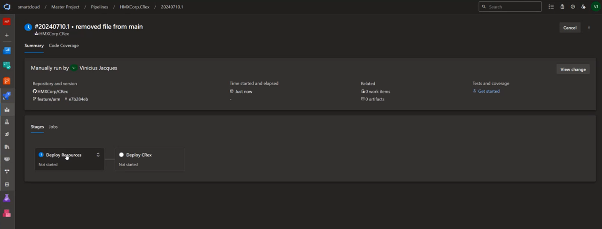

# Red Flags Server and Excel Workbench Add-in

Two important capabilities are available to users of the Accelerator software: (1) the Red Flags Server and (2) the Red Flags Excel Workbench Add-in. The Red Flags Server is an Azure service that enables you to define critical risk signals to monitor and maintain a database of red flags that occur based on data in a database or incoming message flow. The Red Flags Server is an [HMX.ai](https://hmx.ai) CRexTM (Cognitive Reasoning Engine) Enterprise application. References to HMX CRex or CRex in the following can be interpreted as equivalent to the Red Flags Server. The Red Flags Excel Workbench Add-in applies the [HMX.ai CRexTM Add-in for Excel](https://appsource.microsoft.com/en-us/product/office/WA200005695?tab=Overview), which is free to download from Microsoft AppSource. Both the Red Flags Server and Excel Workbench have the following key features:

- **Goal-Oriented** - Define your organization's goals most relevant to managing compliance and transparency.
- **Situation-Centric** - Define the critical situations that your organization wants to track to determine the best actions to take.
- **Cognitive Maps** - Organize goals and situations in a graphical way to represents your red flags management plan.
- **Simulation Scenarios** - Run simulations for what-if scenarios to see the results and fine-tune your management plans.
- **CoPilot Integration** - Investigate how decisions impact organizational goal achievement and situational awareness with natural language Q&A.

## Red Flags Server

The following are prerequisites for deploying the Red Flags Server:

- A GitHub account into which this repository has been cloned.
- A Microsoft Azure subscription
- An Azure DevOps subscription - see [Sign up for Azure DevOps](https://learn.microsoft.com/en-us/azure/devops/user-guide/sign-up-invite-teammates) for information on setting up an Azure DevOps account. You must create a resource group into which the Red Flags Server resources will be deployed.
- An understanding of Azure DevOps including configuring and creating Azure DevOps pipelines - see the [Azure Pipelines documentation](https://learn.microsoft.com/en-us/azure/devops/pipelines/?view=azure-devops) for complete information on this topic.

To create the required resources and deploy the Red Flags Server, follow the steps below. You can inspect and edit the provided YAML files to understand the deployment steps and make adjustments if required; however, only the configurations described below are needed for a sucessfull deployment and completion of the functional tests. The Red Flags Server is deployed as a container application in [Docker](https://www.docker.com/).

### Configuration and Deployment

1. Change the service principal ID. The [azure-resource.parameters.json](RedFlagsServer_and_Workbench/Deployment/ARM/azure-resources.parameters.json) contains two configurations, only one of which is required before deployment:

- registryPassword - this is a secure password for accessing the container from which the CRex (i.e., the Red Flags Server) image will be copied. This is an Azure DevOps variable that should not be altered.
- servicePrincipal - when you follow the steps to connect Azure DevOps to the GitHub repository, a Service Principal will be created automatically. The ID for the Service Principal must be added here.

2. Enter your Azure subscription and resource group location. The [variables.yml](RedFlagsServer_and_Workbench\Deployment\Templates\variables.yml) file contains two configurations:

- azureSubscription - this is your Azure subscription name followed by a space, followed by the subscription ID in parenthesis. For example: 'My Azure Subscription (123456789-d123-12a34-1234-12345678e910ef)'. Note that this Azure subscription is the service connection corresponding to the subscription identified when you connected your Azure DevOps account to the GitHub repository.
- resourceGroupLocation - this is the region in which your resources will be located. You can explore more about Azure regions and their specific features on the [Azure Global Infrastructure page](https://azure.microsoft.com/en-us/explore/global-infrastructure/geographies/).
  
3. Log into the Azure DevOps portal and in the palette select 'Pipelines' to display the Pipelines list, which will be empty if no pipelines have been previously created.

4. Select 'New pipeline' at the top right to display the 'Where is your code' dialog.

5. In the 'Where is your code' dialog, select GitHub and follow the steps to log into your (cloned) repository. The first time you will need to allow connection of Azure DevOps to your GitHub account and this will require your GitHub account administrator's approval. Once connected to GitHub, you can click on GitHub to display the 'Select a repository' dialog.

6. In the 'Select a repository' dialog, choose your repository to display the 'Configure your pipeline' dialog. Select 'Existing Azure Pipelines YAML file' at the bottom of the list to display the 'Select and existing YAML file' pop-up dialog. The YAML file for this deployment is the [deploy-all.yml](./RedFlagsServer_and_Workbench/Deployment/deploy-all.yml) stored in the `RedFlagsServer_and_Workbench\Development` folder of this repository. Select 'main' from the Branch drop-down list and the 'deploy-all.yml' YAML file in the Path drop-down list, then click 'Continue'.

7. In the 'Review your pipeline YAML' dialog, you can inspect the pipeline code; however, for successful functional testing, do not alter this file. Select Run at top right to start the deployment; however, the resource group name you created in the target Azure subscription is not set in the YAML file, so an Error will be displayed. To provide the resource group name, click the 'Run new' button at top right, and in the 'Run pipeline' dialog enter the Resource Group Name that you created (the Branch/tag should already be set appropriately). Click the Run button to start the deployment.

8. The first time a pipeline is created it is necessary to permit a connection to the specified Azure subscription. clicking the Run button in the last step will display a dialog for monitoring the deployment steps; however, the state of the 'Deploy resources' will be 'Not started'. Click on the Deploy Resources step, then in the 'Deploy Resources' dialog select the View button in the pop-up dialog select 'Permit' to enable the connection. In the Pipelines list, confirm that the pipeline is in a running state.

The YAML file will now run and create all required resources, set the needed configurations, deploy the Red Flags Server application, and start the application.

### Functional Test

The last step in the deployment described above starts the Red Flags Server application with a small example based on a production application of the server for real-time VAT Tax compliance. This example implements the 'hot path' or real-time message/transaction processing shown in the bottom left of this high-level depiction of the Microsoft Accelerator architecture that the Red Flags Server, shown at top right, is designed to support.

Every Red Flags Server requires Red Flags Definitions, available as pre-existing templates that are modified as needed to support specific applications, and a Data Model. *No changes are required to these two configuration files to complete the functional tests.*

- **Red Flags Definitions** - red flags are *Situations* that are critical to monitor so that appropriate actions can be taken to correct or mitigate the red flag. The action taken in response to a red flag depends on the *Goals* that you want to achieve.

    For example, in a VAT Tax compliance application, if a commercial taxpayer is possibly avoiding tax obligations by mis-reporting cash payments, as indicated by a high percentage of reported credit-card payments compared to similar businesses, then the Tax Authority goal of "Ensuring correct tax payment rates" is not achieved, and action should be take to notify taxpayers with these red flags of possible non-compliance to tax laws. 

These Goal-Situation (or red flag) relationships are defined in a CRex *Cognitive Map* structure that associates each red flag with a goal. You can examine the structure of the cognitive map used in this example by inspecting the [VAT-Tax-CognitiveMap.json](./RedFlagsServer_and_Workbench/Deployment/Configuration/VAT-Tax-CognitiveMap.json) file, which renders in a graphical construction environment within the Excel Add-in described in the next section, as shown at right in the figure below. No changes should be made to this file.

- **Data Model** - the Red Flags Server requires a data model that defines the atomic data elements, features, and Azure Functions that are used within the red flag definitions defined in the Cognitive Map. The server data model conforms to the [XMI (XML Metadata Interchange) data model file standardized format](https://www.omg.org/spec/XMI/2.5.1). This format is used for exchanging metadata information via XML and is convenient for sharing UML (Unified Modeling Language) diagrams and other model design information between different software tools. The XMI file used in the functional test example is the [VAT-Tax-DataModel.xmi](./RedFlagsServer_and_Workbench/Deployment/Configuration/VAT-Tax-DataModel.xmi) file stored in the Development/Configuration folder. No changes should be made to this file.

The functional tests consist of (a) checking the Container App Log stream to confirm that the server started, loaded the Cognitive Map, and is processing incoming messages/transactions, and (b) checking the SQL Server database tables to confirm that results are being written to the tables. Complete the following two steps to confirm operation of the Red Flags Server.

1. Confirm that the Container App has started and is processing messages. The deployed Red Flags Server includes a Container App. Search for the Container App in the resource group that was created in the deployment, select the Container App, then select 'Log stream' as shown in the figure below. Confirm that the log stream (i) connects successfully and that (ii) 'info' messages report a build number and date, a 'Goal Tree Name', spawning of 3 GoalActors, spawning of 1 SituationManagerActor, and that no errors are reported. Error messages indicate an incorrect deployment or configuration of the resources. Note that the application runs continuously, so you will see 'CRex heartbeat' messages every 30 minutes, unless you stop the Container App.

2. Confirm that results are being written to the SQL Server database. The deployed resources include a SQL database resource that you will find in the resource group listing. Navigate to this resource and select 'Query editor (preview)' (You will need the 'sqladmin' password, which you can retrieve from the 'key vault' resource created in the deployment. Search for the 'Key vault' that was created, navigate to the 'Secrets', select 'Database--AdminPassword', select the 'CURRENT VERSION' in the list, and click the copy icon at the end of the 'Secret value' text box.). Log into the Query Editor and 'situation_results_true' table as shown in the figure below. Confirm that this table contains several rows with data in all columns with the exception of the 'simulation_date' (this) column is not populated since the example Red Flags Server application is running in real-time mode rather than simulation mode).

For more information on the Red Flags Server, implemented in [HMX.ai](https://hmx.ai) CRexTM Enterprise, please email [info@HMX.ai](mailto:info@hmx.ai?subject=Information%20on%20CRex%20Enterprise).

## Red Flags Workbench Excel Add-in

## Prerequisites

- Microsoft 365 subscription
- Internet access
- Access with appropriate credentials to your data sources

## Getting Started

The Workbench uses the familiar capabilities of Excel to simplify creation and management of red flags. The Red Flags Workbench Excel file provided in this repository includes example data tables created from public data sources. You can use this workbook to become familiar with the Workbench Add-in capabilities. You can also create and manage your own red flags using data that you add to Excel by following the steps below.

1. Download [RedFlagsWorkbench-VAT Tax.xlsx](RedFlagsServer_and_Workbench/RedFlagsWorkbench-VATTax.xlsx) Excel Workbook provided in this repository folder and open the file within Excel. An example for procurement compliance, [RedFlagsWorkbench-Procurement.xlsx](RedFlagsServer_and_Workbench/RedFlagsWorkbench-Procurement.xlsx) is also provided. The following instructions assume download of the VAT Tax example Excel workbook.

2. Obtain the HMX.ai CRex Add-in for Excel from the Excel 'File-Get Add-ins' menu item.

- Search AppSource for 'HMX' then click Add next to 'CRex Add-in for Excel'.
- Click the 'HMX CRex' button on the right-hand side of the Excel Home ribbon to open the Add-in.
3. Organize your data in Excel tables.

- You can use any data, organized in Excel Tables.
- To add your own data, use Excel's Data ribbon to get the data you want to analyze and copy it to an Excel worksheet. 
- Each table is a Key Entity in your analysis. Key Entities are what you’re monitoring to achieve your goals. For example, taxpayers, invoices, etc.
4. Create a Cognitive Map.
- On the Add-in landing pane, Click **+** (see figure above) to build your own Cognitive Map.  A Cognitive Map contains the goals you wish to achieve, and the situations that impact them.
5. Create your Cognitive Map as a tree view of your Goals and the important Situations that impact each Goal.

- **Goals** are objectives you want to achieve, like ensuring customer satisfaction, procurement integrity, or maximum ROI.
- **Situations** are the Red Flags (these are used as synonyms below), the conditions that impact achievement of your goals, like compliance red flags.
- **Key Entities** are contained in the Excel tables you inserted into your workbook. They are what you’re monitoring to achieve goals. For example, taxpayers, or invoices. Red Flag are always associated with your key entities, for example, late tax filing is a red flag associated with taxpayer key entities.
- **Goal Impact** measures the favorable or negative impact of a red flag when it is present. A positive Goal Impact indicates a favorable or desirable "review" or "green flag". A negative Goal Impact indicates an adverse or undesired red flag.
6. Define how you assess whether a red flag is present, based on your data, by entering an Excel formula for each red flag Assessor.

- To Enter a red flag Assessor, click the ***f*x** button in the Situation Specification section. This will display the Situation Assessor Editor and Formula Bulder.
  - A Assessor evaluates the presence or absence of the flag.
  - Build your formula in chunks, connected by AND or OR.
  - Use the radio buttons just above the text boxes to specify what you want to enter:
    - **R** = a cell reference for example, Customer!B2
    - **C** = an table structured reference for example, TaxPayer[VATGap]
    - **F** = an Excel formula for example, 0.3 * TaxPayer[Revenue]
    - **V** = a value for example, “active”, 12.3, or “5/2/2023 12:00:00 AM”
  - Select an operator from the center drop-down menu.
  - Use the AND/OR drop down to build the complete formula.

    The Add-in will automatically translate the information you entered to a valid Excel formula shown in the Assessor Formula text box.

  - Enter a Formula Description to describe how the flag is assessed.

7. Now that you have entered Excel data tables and have a Cognitive Map of Goals and Red Flag Situations with Assessors, you can run what-if simulations to see what red flags are present and how they impact Goal achievement.

- At the top of the Add-in click the Scenarios button to move to the Scenario Simulation pane.
- Create a Scenario by clicking the **+** button and entering a name for your Scenario.
- Click the Run button to start a simulation.

    During a simulation, the Add-in assesses each of the red flags you defined for the data you have provided. The Add-in automatically evaluates Goal Achievement based on whether flags are present. Adverse or red flags reduce Goal Achievement while Favorable or green flags increase Goal Achievement.
8.Run and review reports and locate the data causing a red flag.

- The Workbench Add-in creates 3 different reports that you can review including:  
  - ***SitRep*** (Red Flags Situation summary) with each red flag organized by count (the number of red flags present), key entity, and goal impact.
  - ***Goal Satisfaction*** goal satisfaction as a percent for each goal.
  - ***Goal Impact*** the impact of each red flag by each goal.

- Click on the Goals & Situations button at the top of any Workbench Add-in pane and scroll down to the Cognitive Map. The red notification badges indicate the number of flags present for each of the specified flag situations (recall that they can be either red or green flags).
- Click on a flag badge that displays a non-zero value. A list will be displayed where each item is one of the Key Entities, for example a taxpayer or invoice, for which the flag was assessed to be present.
- Click on any item in the displayed list and the focus will shift to the row in the Key Entity table containing the data that caused the flag to be assessed as present. You can then examine these data to understand the cause of the flag.
9.Use OpenAI to obtain explanations of your Red Flag Situation definitions.

- In the Cognitive Map display, mouse over the red flag and select the information ***i*** icon. This will display the red flag formula you entered together with an explanation in natural language.
